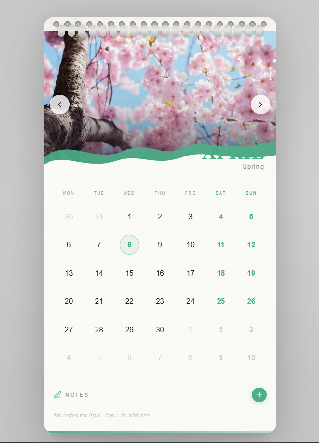

# 📅 Wall Calendar

An interactive, animated wall calendar built with **Next.js 16**, **React 19**, **Framer Motion**, and **Tailwind CSS v4**. Inspired by physical wall calendars — complete with spiral binding, hero photography, day-range selection, and a integrated notes system.



---

## ✨ Features

### Core
- **Wall Calendar Aesthetic** — Spiral binding rings, paper texture overlay, mountain-wave SVG cutout, and stacked-page shadow illusion
- **Hero Photography** — Each month has a unique full-bleed Unsplash photo that slides in with a cinematic animation on month change
- **Day Range Selector** — Click a start date, hover to preview the range live, click an end date to confirm. Clear visual states for start, end, and in-between days
- **Integrated Notes** — Per-month notes with 6 color options. Notes are anchored to dates and auto-saved to `localStorage`
- **Holiday Markers** — 13 US public holidays marked with accent-colored dots

### Design
- **Monthly Theming** — Each month has its own accent color (winter blues, spring pinks, summer oranges, autumn ambers) that cascades across the entire UI — range highlights, weekend labels, note dots, bottom strip, and buttons all adapt
- **Playfair Display + DM Sans** — A refined serif/sans-serif pairing that avoids generic system fonts
- **Paper Texture** — Subtle SVG noise overlay gives the card a tactile, physical feel
- **Responsive** — Single-column card layout works seamlessly on mobile and desktop

### Interactions
- **Framer Motion Animations**
  - Hero image slides left/right on month navigation
  - Day cells stagger-fade in on mount and month change
  - Notes animate in/out of the list
  - Bottom accent strip sweeps in on month change
  - Range badge and selection hint animate in/out
  - Add button rotates 45° to become a close button
- **Live Range Preview** — While selecting an end date, hovering shows a real-time preview of the range without committing
- **Keyboard Support** — `Enter` to save a note, `Shift+Enter` for newline, `Escape` to cancel

---

## 🛠 Tech Stack

| Package | Version | Role |
|---|---|---|
| `next` | 16.2.2 | Framework |
| `react` / `react-dom` | 19.2.4 | UI runtime |
| `framer-motion` | ^11.2.0 | All animations |
| `date-fns` | ^3.6.0 | Date utilities |
| `lucide-react` | ^1.7.0 | Icons |
| `tailwindcss` | ^4 | Utility CSS |
| `@tailwindcss/postcss` | ^4 | Tailwind v4 PostCSS plugin |
| `typescript` | ^5 | Type safety |

---

## 🚀 Getting Started

### Prerequisites
- Node.js 18.17 or later
- npm / yarn / pnpm

### Installation

```bash
# 1. Clone the repo
git clone https://github.com/your-username/wall-calendar.git
cd wall-calendar

# 2. Install dependencies
npm install

# 3. Run the development server
npm run dev
```

Open [http://localhost:3000](http://localhost:3000) in your browser.

### Build for Production

```bash
npm run build
npm start
```

---

## 📁 Project Structure

```text
wdc-induction-portal/
│
├── src/
│   ├── app/
│   │   ├── globals.css
│   │   ├── layout.tsx
│   │   └── page.tsx
│   │
│   ├── components/
│   │   └── Calendar
│   │        ├── WallCalendar.tsx            # Root calendar shell, layout, shadow frame
│   │        ├── CalendarHeader.tsx          # Hero image + spiral binding + month nav
|   |        ├── CalendarGrid.tsx            # Animated 7-column day grid
|   |        ├── DayCell.tsx                 # Single day — range logic, today ring, dots
|   |        ├── NotesSection.tsx            # Notes CRUD — input, color picker, list
|   |        ├── data.ts                     # Month images, holidays, date helper functions
│   │        └── types.ts                    # TypeScript interfaces
│   │
│   ├── hooks/
│       └── useCalendar.ts                
│
├── public/
|    └── preview image                                                  
├── package.json
├── tsconfig.json
└── README.md
```


---

---

## 🎨 How It Works

### Month Navigation
Click the `‹` / `›` arrows to navigate months. The hero image slides out with a page-turn direction cue and the new month's image slides in. The entire UI re-themes to the new month's accent color.

### Day Range Selection
1. **Click any date** — sets the start date (highlighted circle)
2. **Hover** — live preview of the range fills in
3. **Click a second date** — confirms the end date and automatically opens the note input

### Notes
- Notes can be added via the `+` button at any time, or are auto-prompted after a range selection
- Choose from 6 accent colors using the swatch picker
- Press `Enter` to save, `Escape` to cancel
- Notes persist across page refreshes via `localStorage`
- Hover a note to reveal the delete button

### Holidays
US public holidays appear as small accent-colored dots beneath the date number. Hover the dot to see the holiday name in a tooltip.

---

## ⚙️ Configuration

### Adding Your Own Images
Edit `src/components/Calendar/data.ts` and replace the `image` URLs in the `MONTHS` array with your own. Images must be hosted on a domain configured in `next.config.ts`.

### Adding Image Domains
Update `next.config.ts`:

```ts
remotePatterns: [
  {
    protocol: "https",
    hostname: "your-image-host.com",
    port: "",
    pathname: "/**",
  },
],
```

### Adding Holidays
Add entries to the `HOLIDAYS` object in `data.ts`:

```ts
export const HOLIDAYS: Record<string, string> = {
  "2025-01-01": "New Year's Day",
  // add your own...
};
```

### Changing Month Accent Colors
Each entry in the `MONTHS` array in `data.ts` has an `accent` field:

```ts
{ month: 0, year: 2025, accent: "#1a9de0", ... }
```

The accent color cascades automatically to all UI elements for that month.

---

## 📄 License

MIT — free to use, modify, and distribute.

---

## 🙏 Credits

- Photography — [Unsplash](https://unsplash.com)
- Icons — [Lucide](https://lucide.dev)
- Fonts — [Google Fonts](https://fonts.google.com) (Playfair Display, DM Sans, DM Mono)
- Animation — [Framer Motion](https://www.framer.com/motion/)

⭐ If you like this project, consider giving it a **star on GitHub**!
